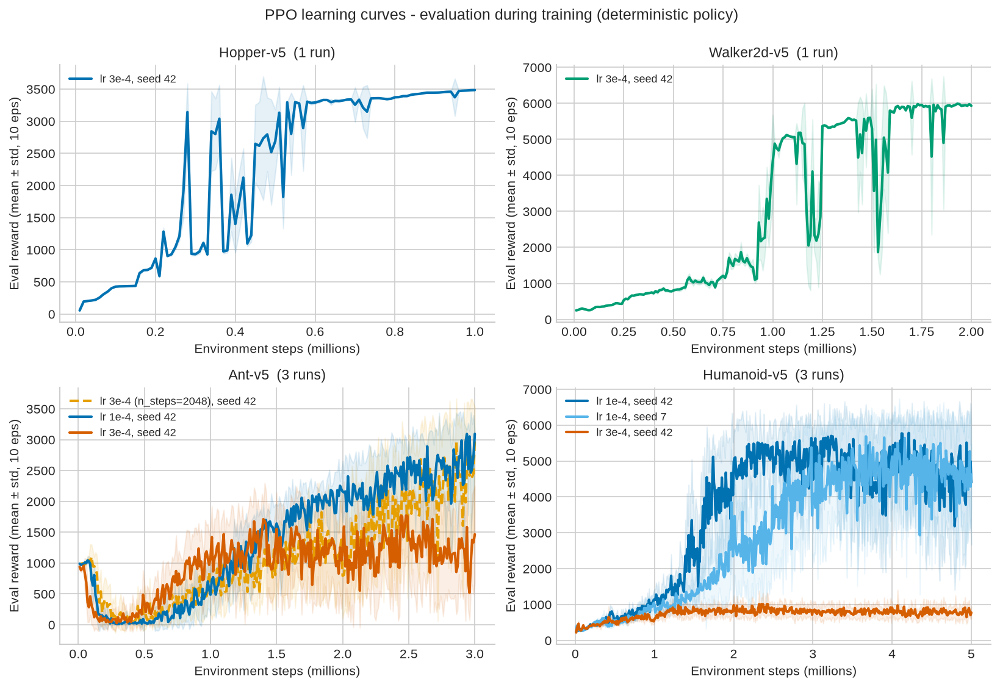
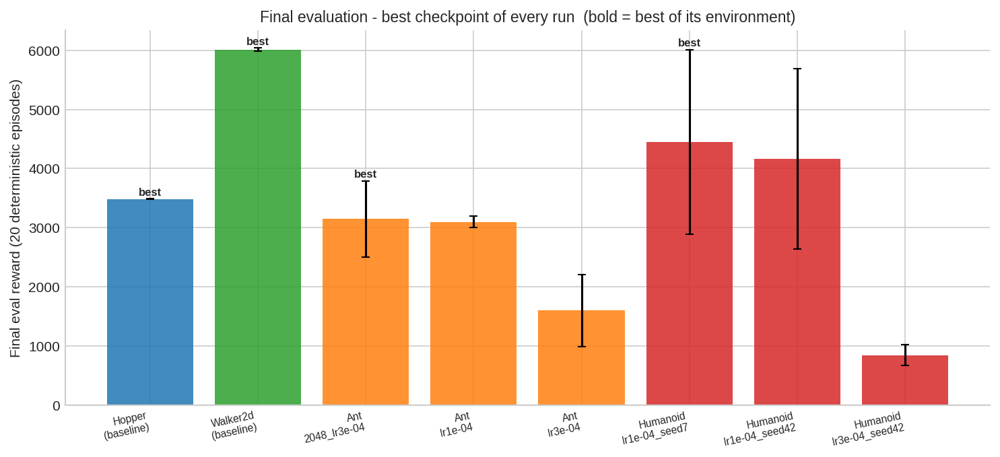

# PPO Locomotion Portfolio — Proximal Policy Optimization on Four MuJoCo Benchmarks

A systematic study of **PPO** (Proximal Policy Optimization) using **Stable-Baselines3**,
covering four continuous-control environments of increasing difficulty:

| Environment | Observation dim | Action dim | Training budget | Best final score (20 deterministic episodes) |
|---|---|---|---|---|
| Hopper-v5 | 11 | 3 | 1M steps | **3 486 ± 5** |
| Walker2d-v5 | 17 | 6 | 2M steps | **6 008 ± 27** |
| Ant-v5 | 105 | 8 | 3M steps | **3 147 ± 645** |
| Humanoid-v5 | 348 | 17 | 5M steps | **4 451 ± 1 556** |

8 training runs in total: a **learning-rate comparison** (1e-4 vs 3e-4) on Ant and Humanoid,
a **seed-robustness check** (seed 42 vs 7 on Humanoid), and a **rollout-length ablation**
(n_steps 1024 vs 2048) on Ant — every run evaluated with the same protocol.

---

## 📄 Main deliverable

- **[REPORT.md](REPORT.md)** — the full write-up: PPO explained from first principles,
  methodology, all experiments with figures, and lessons learned.

## 📊 Headline figures

| | |
|---|---|
|  |  |
| *Eval reward during training, all 8 runs* | *Final 20-episode deterministic evaluation* |

All figures live in [`PPO_SB3/analysis/figures/`](PPO_SB3/analysis/figures/),
generated from the raw run artifacts by a single script.

## 🔑 Key findings

1. **Lower learning rate won everywhere it was tested.** lr 1e-4 beat lr 3e-4 on both
   Ant (+1 323 final reward) and Humanoid (+3 311); lr 3e-4 on Humanoid collapsed into
   an early local optimum (~850) and never escaped.
2. **Seeds matter, but less than the learning rate.** Two seeds at Humanoid lr 1e-4
   finished within ~2% of each other on best eval reward — yet their final 20-episode
   scores differ by ~300 with large variance, so single-run rankings deserve caution.
3. **Bigger rollout buffers help slow learners.** On Ant, n_steps=2048 (vs 1024) was
   slower early but finished slightly ahead (3 147 vs 3 100) with a lower-variance curve.
4. **PPO internals explain the outcomes** (see
   [fig7](PPO_SB3/analysis/figures/fig7_ppo_internals.png)): the winning Humanoid run
   drives clip fraction and approximate KL steadily upward — it sits right at the edge of
   its trust region late in training — while explained variance rises fast on easy tasks.

## 📁 Repository layout

```

├── README.md                        
├── REPORT.md                        # full project report
├── requirements.txt                
└── PPO_SB3/
    ├── ppo_sb3_cheatsheet.md        #practical reference: reading plots, comparing runs, per-env gotchas
    ├── Hopper_SB3/                  # per-env training / eval / recording scripts + run logs
    ├── Walker_2d_Sb3/
    ├── Ant_Sb3/
    ├── Humanoid_sb3/
    └── analysis/                    # systematic evaluation pipeline
        ├── analyze_ppo.py           # rebuilds all tables + figures from raw logs
        ├── final_eval.py            # generic 20-episode deterministic evaluator
        ├── results/                 # CSVs + auto-generated summary.md
        └── figures/                 # all report figures 
```

Each env folder follows the same structure: `train_*.py` → `evaluate_*.py` →
`watch_and_record_*.py` (videos), with `logs/<run>/` holding `evaluations.npz` (during-training
eval curves), Monitor CSVs (training curves), TensorBoard event files, and `models/<run>/`
holding checkpoints + `final_eval_results.json`.

## 🔁 Reproducing

```bash
conda create -n rl python=3.13          # or: conda activate rl (already configured here)
conda activate rl
pip install -r requirements.txt

# rebuild every table and figure from the run artifacts (~1 min):
cd PPO_SB3
python analysis/analyze_ppo.py

# re-run a final evaluation of any checkpoint (20 deterministic episodes):
python analysis/final_eval.py --model-dir Hopper_SB3/models/hopper_ppo --env-id Hopper-v5

# retrain from scratch (example: Humanoid, the 5M-step configuration):
python Humanoid_sb3/train_humanoid_ppo.py --lr 1e-4 --seed 42
```

## 🛠 Tech stack

Python · Stable-Baselines3 2.9 · PyTorch 2.13 · Gymnasium/MuJoCo v5 · TensorBoard · NumPy · Matplotlib

## 📚 References

- Schulman et al., *Proximal Policy Optimization Algorithms* (2017) — arXiv:1707.06347
- Schulman et al., *High-Dimensional Continuous Control Using GAE* (2015) — arXiv:1506.02438
- Stable-Baselines3 — https://github.com/DLR-RM/stable-baselines3
- Gymnasium MuJoCo environments — https://gymnasium.farama.org/environments/mujoco/
