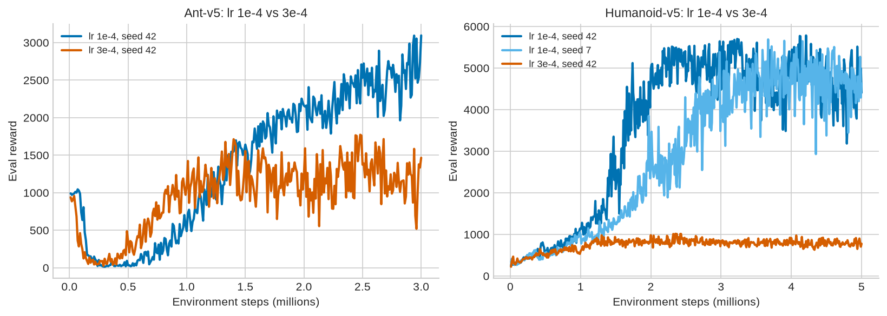
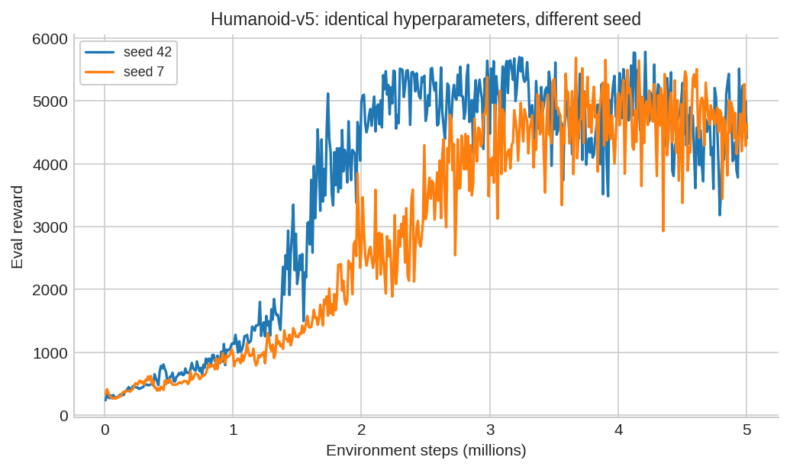
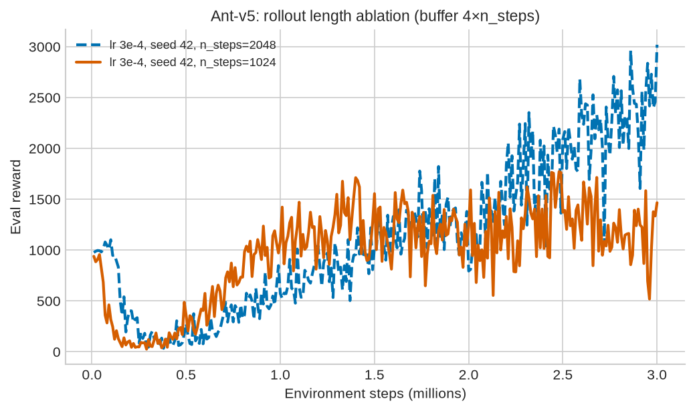
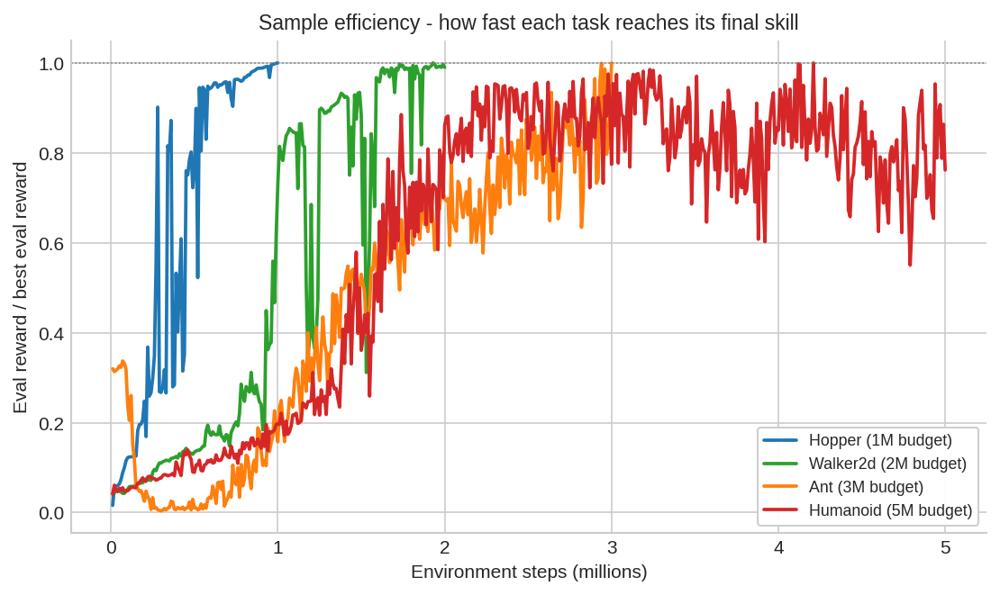
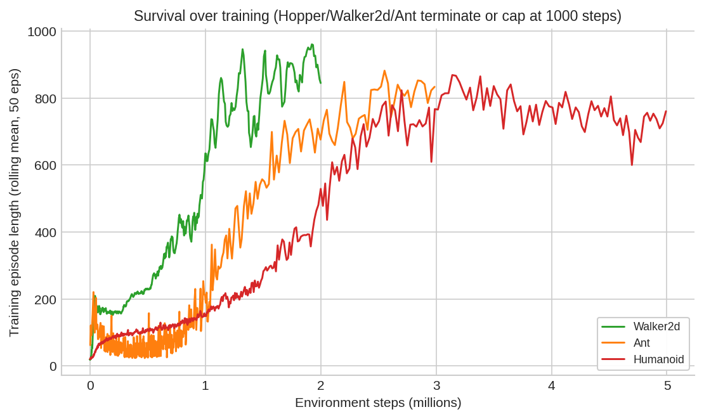
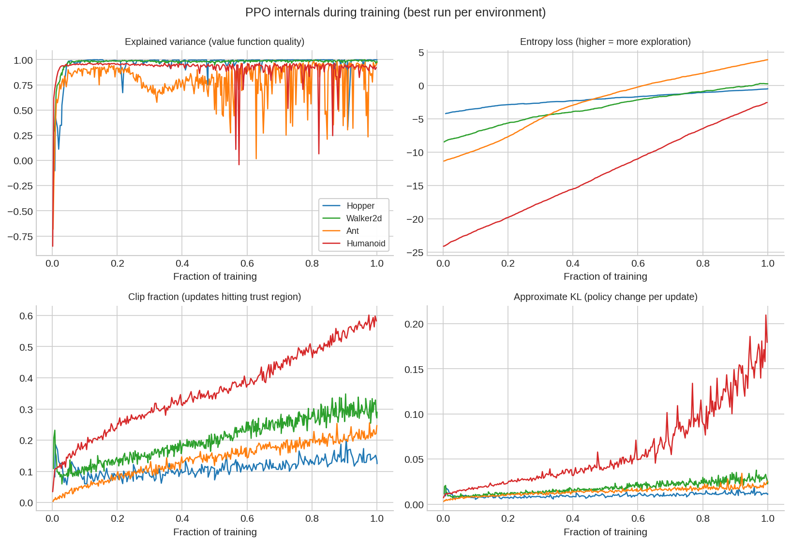
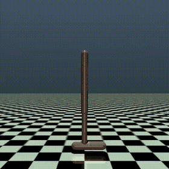
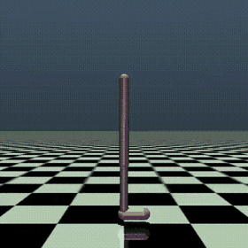
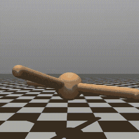

# Training PPO on Four MuJoCo Locomotion Tasks: A Systematic Study

*Proximal Policy Optimization with Stable-Baselines3: from the algorithm's intuition to 8
training runs, a learning-rate comparison, a seed-robustness check, a rollout-length ablation,
and what the training curves actually reveal.*

---

## 1. Executive summary

This project trains **Proximal Policy Optimization (PPO)** on four continuous-control
locomotion tasks of increasing difficulty — Hopper, Walker2d, Ant, and Humanoid — and then
evaluates the results systematically: identical evaluation protocol everywhere, controlled
comparisons of one hyperparameter at a time, and analysis of PPO's internal training signals
(explained variance, entropy, clip fraction, approximate KL) taken from the TensorBoard logs.

**Headline results** (final evaluation: best checkpoint, 20 deterministic episodes, raw reward):

| Environment | Best configuration | Final score | Mean episode length | Budget |
|---|---|---|---|---|
| Hopper-v5 | lr 3e-4, seed 42 | **3 486 ± 5** | 1000.0 (max) | 1M steps |
| Walker2d-v5 | lr 3e-4, seed 42 | **6 008 ± 27** | 1000.0 (max) | 2M steps |
| Ant-v5 | lr 3e-4 + n_steps 2048 | **3 147 ± 645** | ~999 | 3M steps |
| Humanoid-v5 | lr 1e-4, seed 7 | **4 451 ± 1 556** | 778 | 5M steps |

**What the comparisons showed:**

- **Learning rate is the make-or-break hyperparameter.** lr 1e-4 beat lr 3e-4 on *both* tasks
  where they were compared — decisively on Humanoid (≈4 450 vs ≈850), where lr 3e-4 got trapped
  in a "don't fall over yet" local optimum for all 5M steps.
- **Seed sensitivity is real but secondary** on Humanoid: two seeds at lr 1e-4 differed by ~2%
  on best training-time eval, but their final scores still spread ~300 points with large
  per-episode variance.
- **Doubling the rollout buffer (n_steps 1024 → 2048) traded early speed for a better endpoint**
  on Ant: slower over the first 1.5M steps, slightly ahead at the end with more stable curves.
- **PPO's internal metrics told the story before the reward curves did**: runs that converged
  show explained variance climbing to ~0.95+ within the first 10–15% of training, while the
  best Humanoid run sits near the trust-region boundary (clip fraction ≈ 0.6, KL ≈ 0.2) by the
  end — healthy but close to the stability limit.

Everything below is reproducible from the run artifacts in this repository
(see Section 10).

---

## 2. Background: what PPO actually does

Reinforcement learning trains a policy by trial and error: at every step the agent observes
state `s`, takes action `a`, receives reward `r`, and the objective is to maximise expected
total reward. Here the policy is an MLP (two 64-unit tanh layers, SB3's `MlpPolicy` default)
mapping observations to a distribution over continuous actions — sampled during training,
taken at its mean during evaluation.

**PPO** is a policy-gradient method that keeps every update safe with a clipped objective,
avoiding both TRPO's expensive second-order optimisation and vanilla policy gradient's risk of
a single bad update wrecking the policy:

```
L(θ) = E[ min( r_t(θ)·A_t , clip(r_t(θ), 1-ε, 1+ε)·A_t ) ]
where  r_t(θ) = π_θ(a|s) / π_θ_old(a|s)   (probability ratio old→new)
       A_t     = Generalized Advantage Estimation (GAE)
       ε       = clip_range = 0.2
```

If an action performed better than expected (`A_t > 0`), PPO increases its probability — but
once the new policy is more than ε=20% likelier to take it than the old policy was, the
gradient goes to zero, capping the update. The same logic symmetrically bounds decreases for
bad actions. `A_t` itself comes from **GAE** (`gae_lambda=0.95`), an exponentially-weighted
average of k-step advantages built on a learned value function (`gamma=0.99` discounted) — the
quality of that value function, logged as **explained variance**, turned out to be one of the
most informative signals in this project (Section 7).

*(Full derivations: Schulman et al. 2017 and 2015, Section 12.)*

### 2.1 One PPO iteration in SB3

With `n_envs=4` and `n_steps=1024` (the base configuration across all runs here):

```
4 envs × 1024 steps          → 4096 transitions collected per rollout (fresh, on-policy)
4096 / batch_size 256        → 16 minibatches
16 minibatches × n_epochs 10 → 160 gradient updates per rollout
then: repeat from a fresh rollout
```

Evaluation runs on a *separate* env every ~10 000 training steps (`EvalCallback`, 10 episodes,
deterministic policy, obs-normalisation stats synced from training, **rewards never
normalised**). The callback continuously saves the best checkpoint by eval reward.

> A practical reference for reading SB3 PPO runs (how to read the 3-panel plots, buffer
> math, logging cadence, comparing multiple runs, per-environment gotchas, and honest
> portfolio write-up guidance) is in
> [`PPO_SB3/ppo_sb3_cheatsheet.md`](PPO_SB3/ppo_sb3_cheatsheet.md).

### 2.2 Hyperparameters (base configuration, identical across all runs)

| Parameter | Value | Meaning |
|---|---|---|
| `n_envs` | 4 | parallel environments collecting experience |
| `n_steps` | 1024 | rollout length per env (2048 in the Ant ablation) |
| `batch_size` | 256 | minibatch size for SGD |
| `n_epochs` | 10 | optimisation passes over each rollout |
| `learning_rate` | **3e-4 or 1e-4** | the deliberately varied parameter |
| `gamma` | 0.99 | discount factor |
| `gae_lambda` | 0.95 | GAE smoothing |
| `clip_range` | 0.2 | trust-region width ε |
| `net_arch` | [64, 64] tanh (SB3 default) | policy/value MLP |
| `VecNormalize` | obs + reward, clip 10 | running normalisation (training only) |

Reward normalisation is active during training but **disabled at evaluation**, so all scores
reported here are raw environment rewards.

---

## 3. The four tasks

| Task | Goal | Obs dim | Action dim | Why it's harder than the previous one |
|---|---|---|---|---|
| **Hopper-v5** | hop forward on one leg | 11 | 3 | simplest dynamics; terminates on falling |
| **Walker2d-v5** | walk forward on two legs | 17 | 6 | bipedal balance, more coordination |
| **Ant-v5** | walk with four legs | 105 | 8 | more DoF, contact-rich, 1000-step episodes |
| **Humanoid-v5** | walk upright, 17 actuators | 348 | 17 | ~2× Ant's action space, hardest exploration problem |

---

## 4. Experimental design

The experiments were run as a **progression** — each environment's lessons informed the next
one's plan:

1. **Hopper** (1M steps): establish the pipeline end-to-end with SB3 defaults, learn to read
   TensorBoard, set up evaluation.
2. **Walker2d** (2M steps): same configuration, doubled budget for the harder task.
3. **Ant** (3M steps × 3 runs): first controlled comparisons — lr 3e-4 vs lr 1e-4 (identical
   everything else), then a follow-up at lr 3e-4 with `n_steps=2048`, the one change
   hypothesised to help Ant's plateau.
4. **Humanoid** (5M steps × 3 runs): a pre-committed 3-iteration plan — (i) baseline lr 3e-4,
   (ii) change *only* the lr to 1e-4, (iii) re-run the winning configuration with a different
   seed to check the win wasn't seed luck. No other hyperparameter was touched.

**Evaluation protocol (identical for every run):** during training, `EvalCallback` runs 10
deterministic episodes every ~10k steps and checkpoints the best model; at the end, each best
checkpoint is re-evaluated for **20 deterministic episodes** on a fixed seed-2024 environment
with frozen observation normalisation and unnormalised rewards. That's the number reported in
every table here.

---

## 5. Results

*The learning curves and the table below carry most of the story. Section 6 has the supporting
ablations for anyone who wants the deeper cut on a specific claim.*

### 5.1 Learning curves


*Evaluation reward (mean ± std over 10 episodes) during training. All 8 runs on their native
budgets: 1M (Hopper), 2M (Walker2d), 3M (Ant), 5M (Humanoid).*

The four tasks form a clean difficulty ladder. Hopper converges within ~700k steps and rides
the 1000-step episode cap. Walker2d needs ~1.5M steps and shows the characteristic
"learn-to-walk-then-forget-then-relearn" dips around 1.2–1.5M before stabilising. Ant's three
runs climb slowly and are still improving at the 3M budget — it was the first task where the
default configuration clearly underperformed and a real ablation became necessary. Humanoid's
lr 1e-4 runs needed ~2M steps to take off, then climbed steeply to ~5 000+ — while the lr 3e-4
run (red) flatlines near 800–1 000 for the entire 5M budget.

### 5.2 Complete results table

| Env | Run | LR | Seed | n_steps | Budget | Best eval (train-time) | Final eval (20 eps) | Steps to 50% of best |
|---|---|---|---|---|---|---|---|---|
| Hopper | `hopper_ppo` | 3e-4 | 42 | 1024 | 1M | 3 486 | 3 486 ± 5 | 270 k |
| Walker2d | `walker2d_ppo` | 3e-4 | 42 | 1024 | 2M | 5 993 | 6 008 ± 27 | 970 k |
| Ant | `ant_ppo_lr1e-04` | 1e-4 | 42 | 1024 | 3M | 3 095 | 3 100 ± 97 | 1.41 M |
| Ant | `ant_ppo_2048_lr3e-04` | 3e-4 | 42 | 2048 | 3M | 3 018 | **3 147 ± 645** | 1.74 M |
| Ant | `ant_ppo_lr3e-04` | 3e-4 | 42 | 1024 | 3M | 1 771 | 1 605 ± 608 | 10 k* |
| Humanoid | `humanoid_ppo_lr1e-04_seed42` | 1e-4 | 42 | 1024 | 5M | 5 783 | 4 160 ± 1 525 | 1.43 M |
| Humanoid | `humanoid_ppo_lr1e-04_seed7` | 1e-4 | 7 | 1024 | 5M | 5 687 | **4 451 ± 1 556** | 1.97 M |
| Humanoid | `humanoid_ppo_lr3e-04_seed42` | 3e-4 | 42 | 1024 | 5M | 1 014 | 850 ± 179 | 350 k* |

\* The lr 3e-4 Ant and Humanoid runs reached half of their *own* best score very early, then
plateaued — "50% of best" measures speed to a threshold, not final quality. For stuck runs the
meaningful number is the best eval itself, which never escaped the local optimum.

---

## 6. Supplementary ablations

*Each figure below supports one specific claim from Section 5 in more detail — largely the
same underlying runs, isolated and decluttered for that one comparison.*

### 6.1 Learning-rate comparison



*lr 1e-4 vs 3e-4 with everything else fixed (blue vs red).*

- **Ant**: lr 1e-4 reached 3 095 vs 1 771 for lr 3e-4 — the lower lr is both better *and*
  visibly more stable (the red curve oscillates hard between 1M and 3M).
- **Humanoid**: the starkest result of the project. lr 3e-4 topped out at ~1 000 (a
  barely-standing local optimum) and never left it across 5M steps; lr 1e-4 took ~2M steps to
  escape but then climbed to ~5 700. The lesson: on harder exploration problems the *default*
  lr can be exactly the thing that prevents learning, and the failure mode looks like "task
  too hard" rather than "lr too high".

### 6.2 Seed robustness



*Identical configuration (Humanoid, lr 1e-4), seed 42 vs seed 7.*

The two seeds agree closely on the outcome (best eval 5 783 vs 5 687, ~2% apart) but differ in
the path: seed 42 took off ~500k steps earlier and spends the last 2M steps in a
higher-variance plateau, while seed 7's final 20-episode score is actually higher (4 451 vs
4 160). Conclusion: the lr 1e-4 "win" replicates across seeds, but single-seed differences of
a few hundred reward points are within noise for this task.

### 6.3 Rollout-length ablation (Ant)



*Ant-v5, lr 3e-4, n_steps 1024 (solid) vs 2048 (dashed).*

At eval@1M the 1024 run was far ahead (1 085 vs 571) — larger buffers compute advantages over
longer horizons, which dilutes the signal early when everything is noise. But by 3M the 2048
run had caught up and passed (best eval 3 018 vs 1 771; final 3 147 vs 1 605), and its final
checkpoint generalises with fewer catastrophic episodes. Interpretation: with 16 384
transitions per update, each gradient batch contains more complete behaviours, which
stabilises learning once the environment's credit-assignment structure matters more than raw
sample throughput.

### 6.4 Sample efficiency across tasks



*Best run per environment, reward normalised by that run's best value.*

All four tasks follow the same shape: near-linear slow grind to ~50%, then rapid take-off.
Normalized to their own budgets, Hopper and Walker2d reach ~90% of final skill by ~60% of
their budget; Ant and Humanoid spend the first half of training below 40% of their eventual
performance. Practical rule this suggests: if a run hasn't taken off by ~50% of the planned
budget, don't kill it — but do check the internal signals (Section 7) to distinguish
"slow start" from "stuck".

### 6.5 Episode length (survival)



*Training episode length (rolling mean over 50 episodes), best run per environment that has
Monitor logs (Hopper's first run predates Monitor logging, so only its eval curve exists).*

Episode length separates "learned to survive" from "learned to score". Walker2d and Ant climb
to the 1000-step cap and sit there — surviving is solved. Humanoid's episodes plateau around
750–780 steps: even the best policy still falls about a quarter of the way before the cap on
average, which matches the ±1 500 final-eval spread visible in the results table (Section 5.2).
The residual gap between
"walks far" and "never falls" is exactly what a follow-up run (entropy bonus, more budget, or
a larger net) should target.

---

## 7. Inside PPO: what the internal metrics revealed



*Training dynamics for the best run of each environment, plotted against the fraction of that
run's total training (so different budgets can be compared on one axis).*

**Explained variance (top left).** Starts near −1 everywhere, shoots to ≈0.95–1.0 within the
first ~10% of training. Hopper/Walker2d lock in and stay there; Ant/Humanoid keep dipping,
their value functions stay periodically "surprised" by contact-rich, high-dimensional reward
signals throughout training.

**Entropy loss (top right).** `−mean entropy`, so rising = more deterministic. Scale tracks
action-space size (Hopper/Walker2d ≈−4/−8, Ant ≈−11, Humanoid ≈−24). Every successful run
converges toward determinism roughly linearly; the *failed* Humanoid lr 3e-4 run collapsed
toward determinism early instead and it committed to "stand still" before exploring enough to
find walking.

**Clip fraction (bottom left).** Fraction of samples hitting the ±20% trust-region bound.
Hopper stays lowest (≈0.15, gentle updates); Humanoid climbs to ≈0.6 — by the end, over half of
samples sit at the clip boundary. 

**Approximate KL (bottom right).** Same story, quantified: Hopper/Walker2d/Ant hold
KL ≈ 0.01–0.03; Humanoid drifts an order of magnitude higher (≈0.2 late-training spikes). 

---

## 8. Lessons learned

1. **Change one thing at a time, and pin everything else in code.** The lr comparisons stayed
   clean because both invocations had every hyperparameter explicit, nothing silently defaulted.
2. **The default learning rate is not sacred.** On Humanoid, lr 3e-4 didn't just underperform but
   it made learning look impossible; lr is the first knob to question before adding network
   capacity or reward shaping.
3. **A failing run is diagnosable from its internals, not just its reward curve**: entropy
   collapse + near-zero explained variance + flat reward = premature commitment; entropy still
   falling + explained variance rising = still learning, give it budget.
4. **Separate training normalisation from evaluation reality.** `VecNormalize(norm_reward=True)`
   keeps updates stable, but every reported score here uses frozen obs stats and raw,
   unnormalised reward.
5. **Speed-to-threshold and final performance are different metrics** — Ant's 1024 vs 2048
   ablation was ahead early, behind late. Pick the metric that matches the actual goal before
   comparing runs.
6. **Report variance, not just means** — the gap between ±5 (Walker2d) and ±1 500 (Humanoid)
   changes the actual conclusion about what a policy has learned.

---

## 9. Rollout demos

### Hopper-v5 and Walker2d-v5

| Hopper | Walker2d |
|---|---|
|  |  |

### Ant-v5 — lr 1e-4 vs lr 3e-4

| lr 1e-4 (Section 6.1 winner) | lr 3e-4 |
|---|---|
|  |  |

### Humanoid-v5 — the local optimum, visibly

| lr 3e-4 (stuck) | lr 1e-4, seed 42 | lr 1e-4, seed 7 |
|---|---|---|
|  |  |  |

The lr 3e-4 clip is the clearest visual in this project: the agent isn't falling over, and it
isn't moving forward either — the "stand still, collect survival reward" local optimum from
Section 6.1, made it clear.

---

## 10. Reproducing the results

```bash
conda create -n rl python=3.13     # or use an existing env matching requirements.txt
conda activate rl
pip install -r requirements.txt

cd PPO_SB3

# 1) rebuild every table and figure from the raw run artifacts (~1 min, no GPU):
python analysis/analyze_ppo.py

# 2) re-run the 20-episode final evaluation of any checkpoint:
python analysis/final_eval.py --model-dir Hopper_SB3/models/hopper_ppo --env-id Hopper-v5

# 3) retrain from scratch (examples):
python Hopper_SB3/train_hopper_ppo.py
python Ant_Sb3/train_ant_ppo.py --lr 1e-4
python Ant_Sb3/train_ant_ppo.py --lr 3e-4 --n-steps 2048   # the rollout-length ablation
python Humanoid_sb3/train_humanoid_ppo.py --lr 1e-4 --seed 42
```

Training used a single consumer GPU (CUDA), though PPO with an MLP policy is CPU-viable at
these scales; the 5M-step Humanoid run is the longest at a few hours.

The auto-generated companion table
[`analysis/results/summary.md`](PPO_SB3/analysis/results/summary.md) is produced by the
pipeline and matches every number quoted here.

---

## 11. Potential Future work

- **KL early-stopping** (`target_kl`) or lr decay for Humanoid, whose clip fraction ≈ 0.6 /
  KL ≈ 0.2 show it riding the trust-region limit.
- **Entropy-coefficient tuning** (`ent_coef > 0`) for stuck-on-standing local optima.
- **More seeds per configuration** (3–5) to turn the seed observation into a real confidence
  interval.
- **Network scaling for Humanoid** (`net_arch=[256, 256]`), untried here by design since the
  plan was to isolate the learning-rate effect first.
- **Algorithm comparison**: run SAC or TD3 on the same tasks for an on-policy vs off-policy
  sample-efficiency contrast.

---

## 12. References

- Schulman, J. et al. (2017). *Proximal Policy Optimization Algorithms.* arXiv:1707.06347
- Schulman, J. et al. (2015). *High-Dimensional Continuous Control Using Generalized Advantage
  Estimation.* arXiv:1506.02438
- Raffin, A. et al. (2021). *Stable-Baselines3: Reliable Reinforcement Learning Implementations.*
  JMLR 22(268). https://github.com/DLR-RM/stable-baselines3
- Towers, M. et al. (2024). *Gymnasium: A Standard Interface for Reinforcement Learning
  Environments.* https://gymnasium.farama.org/environments/mujoco/